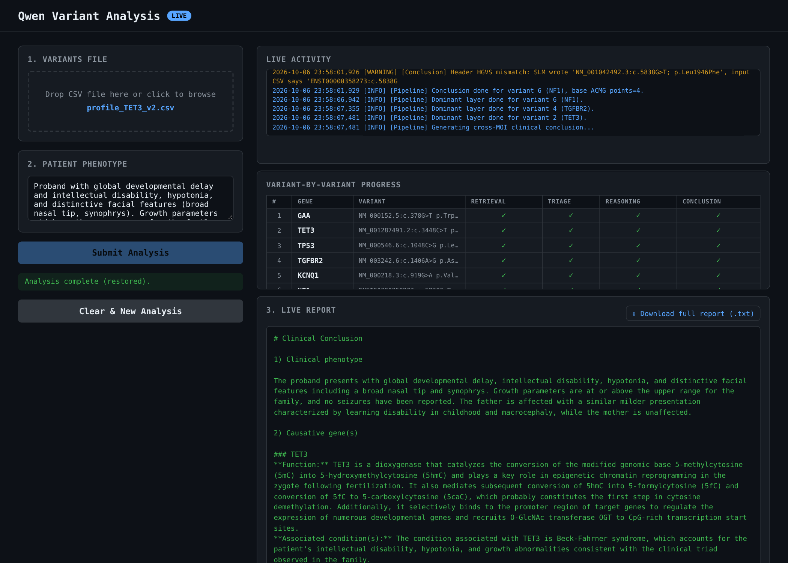

# ServerQwen — Qwen Variant Analysis Server

## Installation

IVA runs as two processes on one GPU machine: a **vLLM** server hosting the
Qwen3.5-9B model, and the **IVA web server** (FastAPI), which runs the pipeline
and serves the browser UI and HTTP API on port 8002. `start_iva.sh` starts both
in the right order. The same `environment.yml` defines the software for the
native install and for the Docker image.

**Requirements**

- Linux x86_64 with an NVIDIA GPU and a driver supporting CUDA 12, and a C
  compiler (`gcc`; e.g. `apt install build-essential`) — vLLM's Triton kernels
  compile a small helper at startup. The Docker image installs it. Tested on an
  A100 40 GB; the model uses about 18 GB for its weights, and vLLM takes 90 % of
  GPU memory by default (`GPU_MEMORY_UTILIZATION`).
- About 30 GB of disk: ~10 GB for the Python/CUDA environment, ~18 GB for the
  model weights (downloaded from Hugging Face on first start).
- Internet access at run time: Hugging Face (first start only) and the public
  evidence APIs the pipeline queries per variant (NCBI E-utilities, ClinVar,
  LitVar2, gnomAD, ClinGen, AutoPVS1, SpliceAI).
- Optional: a free NCBI API key (`NCBI_API_KEY`) raises the NCBI rate limit
  from 3 to 10 requests/s.
  NCBI counts requests per key, so servers sharing one key should each set
  `NCBI_MAX_RPS` to their share (e.g. `NCBI_MAX_RPS=2.5` for 4 servers).

### Option A — native install (conda)

```bash
git clone https://github.com/fredsanto/IVA.git
cd IVA
conda env create -f environment.yml        # creates the "iva" environment (~9 GB, ~5-15 min)
conda activate iva

export HF_HOME=/path/with/20GB/free        # optional: where the model weights are cached
export NCBI_API_KEY=your_key               # optional
./start_iva.sh                             # first start downloads the weights, then loads them (a few minutes)
```

`start_iva.sh` waits until vLLM reports the model as loaded, then starts the web
server. When the log prints `IVA web server on http://0.0.0.0:8002`, check it:

```bash
curl http://localhost:8002/health          # {"status":"ok","backend":"direct",...,"direct_available":true}
```

### Option B — Docker (image built locally)

No prebuilt image is published; the image is built from this repository's
`Dockerfile`. Needs Docker with the
[NVIDIA Container Toolkit](https://docs.nvidia.com/datacenter/cloud-native/container-toolkit/install-guide.html).

```bash
git clone https://github.com/fredsanto/IVA.git
cd IVA
docker build -t iva .                      # ~8 GB image, ~5-15 min
docker run --gpus all -p 8002:8002 \
    -v iva-models:/models \
    -v "$PWD/results:/opt/iva/results" \
    -e NCBI_API_KEY=your_key \
    iva
```

The `iva-models` volume keeps the downloaded weights between runs; `results/`
receives the saved reports. Check with `curl http://localhost:8002/health` as above.

### Using it

- **Browser:** open `http://localhost:8002`, upload a variant CSV/Excel file and
  type the patient phenotype. On a remote machine, tunnel the port first:
  `ssh -N -L 8002:<gpu-host>:8002 <user>@<login-host>`.
- **HTTP API:**
  ```bash
  curl -F csv_file=@variants.csv -F patient_report="visual impairment" \
       http://localhost:8002/analyze          # -> {"job_id": "...", ...}
  curl http://localhost:8002/result/<job_id> # {"status":"running"} until {"status":"done","result":...}
  ```
  Input columns are described in
  [`Qwen_Engine_IVA/IVA_vllm/README.md`](Qwen_Engine_IVA/IVA_vllm/README.md#input-format).
- **SLURM clusters:** `launch_qwen.sh` is the SLURM batch-job version
  (environment modules, SSH tunnel info); see
  [Running on the Cluster](#running-on-the-cluster-full-pipeline).

### Option C — let a coding agent install it

Paste this prompt into a general coding agent (Claude Code, Codex, Cursor, …)
running on the target machine:

```text
Install and start IVA (Intelligent Variant Analysis) from https://github.com/fredsanto/IVA
on this machine, then prove it works. Steps:

1. Check prerequisites and report them before installing: Linux x86_64,
   `nvidia-smi` shows an NVIDIA GPU (40 GB class recommended) and a driver
   supporting CUDA 12, a C compiler (`gcc`) for the native route, at least
   30 GB free disk, internet access. If there is no NVIDIA GPU, stop and tell
   me — IVA cannot run without one.
2. Clone the repository and read README.md (Installation section).
3. Choose the install route: if `docker` and the NVIDIA Container Toolkit are
   available (`docker run --rm --gpus all ubuntu nvidia-smi` works), use
   Option B (docker build + docker run). Otherwise use Option A (conda/mamba:
   `conda env create -f environment.yml`, then `conda activate iva`). If
   neither conda nor docker is installed, install Miniforge in my home
   directory first.
4. Set HF_HOME to a directory with at least 20 GB free if the home directory
   is small. Do not change environment.yml, the Dockerfile or any pipeline code.
5. Start IVA with ./start_iva.sh (native) or the docker run command (Docker),
   in the background, and wait until the log shows
   "IVA web server on http://0.0.0.0:8002" — the first start downloads ~18 GB
   of model weights and can take a while.
6. Verify: `curl http://localhost:8002/health` must return "status":"ok" and
   "direct_available":true.
7. Report back: the install route used, the GPU found, where the model weights
   are cached, the command to start IVA again later, and the /health output.
   If any step fails, show the exact error and the last 30 lines of
   logs/vllm_server.log instead of guessing a fix.
```

---

FastAPI web server exposing a genomic variant analysis pipeline powered by **Qwen3.5-9B** running under **vLLM**. Designed for a SLURM-managed HPC cluster (GPU nodes) with SSH tunnel access from a laptop.

`$PROJECT_ROOT` below is the directory containing this `ServerQwen/` repo and the `.venv_qwen/` virtualenv, e.g. `export PROJECT_ROOT=/path/to/GenMasterAI`.

Git username: `fredsanto`

---

## Demo — synthetic trios

[`TRIO_SYNTH_DEMO/`](TRIO_SYNTH_DEMO/) holds eleven small synthetic trio variant tables for trying the server end to end without patient data. Each file has one causative gene plus noise variants in unrelated genes, with proband and parental allelic balance in the `Allelic_Balance_proband` / `Allelic_Balance_mother` / `Allelic_Balance_father` columns (0 = absent, 0.5 = heterozygous, 1 = homozygous/hemizygous).

| File | Causative gene | Inheritance in the trio |
|------|----------------|-------------------------|
| `profile_CHD2_v2.csv` | CHD2 | de novo heterozygous |
| `profile_EBF3_v2.csv` | EBF3 | de novo heterozygous |
| `profile_KDM2A_v2.csv` | KDM2A | de novo heterozygous |
| `profile_MECP2_v2.csv` | MECP2 | de novo, X-linked |
| `profile_TET3_v2.csv` | TET3 | heterozygous, inherited from the father |
| `profile_GNRHR_v2.csv` | GNRHR | compound heterozygous (one variant per parent) |
| `profile_PMM2_v2.csv` | PMM2 | compound heterozygous (one variant per parent) |
| `profile_PMM2_denovo_comphet.csv` | PMM2 | compound heterozygous (maternal + de novo) |
| `profile_GPR179_v2.csv` | GPR179 | homozygous, both parents carriers |
| `profile_WWOX_v2.csv` | WWOX | homozygous, both parents carriers |
| `profile_RS1_v2.csv` | RS1 | hemizygous, X-linked, maternal carrier |

Each table has a matching phenotype description (`<profile>.phen.txt`, e.g. `profile_MECP2_v2.phen.txt`). Upload the table in the browser and paste its phenotype, or use the API:

```bash
curl -F csv_file=@TRIO_SYNTH_DEMO/profile_MECP2_v2.csv \
     -F patient_report="$(cat TRIO_SYNTH_DEMO/profile_MECP2_v2.phen.txt)" \
     http://localhost:8002/analyze
```

The expected gene should appear among the causative findings of the report.

---

## Architecture

```
Laptop browser
     │  SSH tunnel
     ▼
Login node (cluster login host)
     │
     ▼
Compute node (dnagpuXXX) :8002  ←── server_qwen.py (FastAPI/uvicorn)
     │
     ├── direct mode  →  pipeline module (Qwen_Engine_IVA/IVA_vllm)  →  vLLM :38103
     └── proxy mode   →  pipeline HTTP server :8000  →  vLLM :38103
```

The server **cannot be accessed directly from outside the cluster**. All browser access requires an SSH tunnel through the login node to the compute node.

---

## Files

| File | Purpose |
|------|---------|
| `server_qwen.py` | Main FastAPI app — all routes, job management, SSE streaming, per-variant progress |
| `launch_qwen.sh` | SLURM batch script — starts vLLM + ServerQwen on a GPU node. **The only supported way to launch the server** |
| `test_server.py` | Integration test suite |
| `requirements.txt` | Python deps: `fastapi`, `uvicorn`, `httpx`, `python-multipart` |
| `templates/index.html` | Single-page web UI |
| `Qwen_Engine_IVA/` | Self-contained copy of the pipeline (`IVA_vllm/`) + its conda env (`env_vllm_0606/`) — see [Pipeline Location](#pipeline-location) below |
| `results/` | Saved pipeline output reports (`<stem>_<timestamp>/report.txt`) |
| `.connection` | Written by `launch_qwen.sh` — contains compute node name and port |
| `server_qwen_<JOBID>.log` | Per-SLURM-job log (stdout + stderr merged) |
| `vllm_server.log` | vLLM process log |

---

## Pipeline Location

The pipeline package and its conda env live **inside ServerQwen**, at `Qwen_Engine_IVA/IVA_vllm` and `Qwen_Engine_IVA/env_vllm_0606` — a self-contained copy, not a reference to the first version `eric_folder/genova_vllm_556_0610` (which is a separate, independently-tracked repo). ServerQwen only ever reads/edits its own copy under `Qwen_Engine_IVA/` — the two are not kept in sync automatically; a change made in one does not appear in the other unless copied over manually.

All paths are self-resolving, not hardcoded to a specific user/checkout location:
- `launch_qwen.sh` derives its own directory from `$SLURM_SUBMIT_DIR` (falls back to `$(pwd)`)
- `server_qwen.py` derives `_ERC_FOLDER` from its own file location (`Path(__file__).parent`)

So the whole `ServerQwen/` folder can be relocated or checked out anywhere without editing any script.

---

## Backend Modes

| Mode | How it works | When to use |
|------|-------------|-------------|
| `direct` (default on cluster) | Imports the pipeline Python package directly from `Qwen_Engine_IVA/IVA_vllm`; runs it in a thread with its own event loop | Full analysis on GPU node |
| `proxy` | Delegates to a separate pipeline HTTP server at `PIPELINE_SERVER_URL` (default `http://localhost:8000`) | When a pipeline server is already running separately |

Auto-falls back to `proxy` if the pipeline module is not importable.

### Environment variables

| Variable | Default | Description |
|----------|---------|-------------|
| `PIPELINE_BACKEND` | `proxy` | `direct` or `proxy` |
| `PIPELINE_SERVER_URL` | `http://localhost:8000` | Pipeline HTTP server URL (proxy mode only) |
| `VLLM_BASE_URL` | `http://localhost:8001` | vLLM base URL (direct mode and chat) |
| `PORT` | `8002` | ServerQwen listening port |

In `launch_qwen.sh`, vLLM is started on port **38103** and `VLLM_BASE_URL` is set accordingly.

---

## API Endpoints

| Method | Path | Description |
|--------|------|-------------|
| `GET` | `/` | Web UI (serves `templates/index.html`) |
| `GET` | `/health` | Backend status, mode, pipeline URL, direct_available flag |
| `POST` | `/analyze` | Submit CSV + phenotype → returns `{job_id, stream_url}` |
| `GET` | `/stream/{job_id}` | SSE stream of job progress events |
| `GET` | `/result/{job_id}` | Poll final result (non-streaming) |
| `POST` | `/cancel/{job_id}` | Cancel a running job |
| `POST` | `/chat/{job_id}` | SSE stream of follow-up Q&A against the completed report |
| `GET` | `/activity/{job_id}` | SSE stream of captured server log lines (live activity panel) |

### `/analyze` request (multipart/form-data)

```
csv_file       — variants CSV file
patient_report — free-text patient phenotype description
```

Returns:

```json
{"job_id": "abc123def456", "stream_url": "/stream/abc123def456"}
```

`job_id` is a 12-character hex string.

### SSE event types

| Type | Fields | Description |
|------|--------|-------------|
| `status` | `message` | Human-readable status update |
| `progress` | `stage`, `done`, `total`, `variant_idx`, `gene`, `message` | Per-variant stage completion tick |
| `progress` (normalized) | `stage="normalized"`, `n_variants`, `variants[]` | Initial variant list — used to build the variant table in the UI |
| `stage` | `stage`, `message` | Pipeline stage transition |
| `result` | `data` | Final report text |
| `error` | `message` | Fatal error |
| `cancelled` | `message` | Job cancelled by user |
| `done` | — | Stream end (activity log) |
| `token` | `text` | Chat streaming token |
| `log` | `line` | Raw server log line (activity panel) |

---

## Job Lifecycle

1. `POST /analyze` creates a job with a 12-char hex UUID, returns `job_id`
2. Background `asyncio.Task` runs `_run_direct()` or `_run_proxy()`
3. **Direct mode**: the CSV header is inspected by the SLM first (see [CSV Header Interpretation](#csv-header-interpretation) below), then the pipeline runs in a `ThreadPoolExecutor` thread with its own sub-loop; stage functions are monkey-patched to emit per-variant SSE ticks without blocking the main event loop
4. Progress events accumulate in an in-memory event buffer per job
5. Client connects to `GET /stream/{job_id}` — SSE events are polled every 200 ms and streamed
6. Final `result` event contains the full report text
7. Result saved to `results/<filename_stem>_<YYYYMMDD_HHMMSS>/report.txt`
8. Stale jobs (> 1 hour old) cleaned up every 5 minutes
9. `job_id` is persisted to browser `localStorage` on submit; on page refresh, the UI reconnects to a running job or restores a completed result automatically

---

## CSV Header Interpretation

Before normalization, the CSV header row (+ one sample data row) is inspected by the SLM (`pipeline/core/normalizer.py`'s `_map_columns_llm`) to figure out which original column corresponds to which canonical field (chromosome, position, transcript, HGVS, zygosity, allelic balance, frequency, in-silico scores — CADD/REVEL/SIFT/PolyPhen-2/AlphaMissense/SpliceAI, ClinVar, etc.), instead of the old fixed alias dictionary (`_map_columns_old`, kept for reference but no longer called). Handles arbitrary/renamed headers, not just ones on a known-aliases list.

The SLM is asked for JSON keyed by the fixed canonical field names (not by the original column names) — column-name values are matched back with a whitespace/case-normalized fallback — because requiring the model to echo column names byte-exact as JSON *keys* proved fragile on real-world headers (BOM/whitespace artifacts silently broke exact-match lookups).

Trio allelic-balance columns named `Allelic_Balance_<proband/mother/father>` (any case) are detected structurally by regex beforehand, not sent to the SLM — that pattern is unambiguous and mechanical. Any other allelic-balance naming is classified by the SLM like the rest of the header.

What the SLM understood is surfaced twice:
- Live, via an SSE `status` event right after normalization (`"Column header interpretation (SLM-driven): ..."`)
- In the saved report, as its own `COLUMN HEADER INTERPRETATION` section before `PROCESS DETAILS`

---

## Per-Variant Live Progress (direct mode)

The pipeline runs retrieval, triage, reasoning, and conclusion stages for every variant. To emit live SSE ticks without modifying the pipeline package:

- `pipeline_obj._executor.run_variant` is monkey-patched to call `_tick("retrieval", ...)` after each variant's retrieval completes
- `pipeline.stages.first_triage.run_one`, `reasoning.run_one`, `conclusion.run_one` are monkey-patched at the module level (so the lookup inside `pipeline.run()` picks up the patch)
- Each tick pushes a `progress` event from the worker thread to the main asyncio loop via `asyncio.run_coroutine_threadsafe()`
- Patches are always restored in a `finally` block

The UI builds a variant status table from the initial `progress/normalized` event and updates each cell (retrieval / triage / reasoning / conclusion) as ticks arrive.

---

## ACMG Secondary Findings (Actionable Variants)

Every variant is also checked against the ACMG SF v3.2 reportable gene list (81 genes —
cancer predisposition, cardiac disease, metabolic disease, etc.). A Pathogenic/Likely
pathogenic variant in one of these genes is reported regardless of relevance to the
patient's phenotype and regardless of proband/parental origin — it cannot be filtered
out by triage. When one or more such variants are found, the report gains an
`ACTIONABLE VARIANTS (ACMG SF)` section after the Clinical Conclusion. See the pipeline
README (`Qwen_Engine_IVA/IVA_vllm/README.md`) for implementation
detail and `SOP_ACMG_SF.md` for the clinical procedure.

---

## Running on the Cluster (full pipeline)

### 1. Submit the SLURM job

```bash
# On the login node
cd $PROJECT_ROOT/ServerQwen
sbatch launch_qwen.sh
```

`launch_qwen.sh` will:
1. Allocate 1 GPU node (`gpu` partition, 4 CPUs, 16 GB RAM, 1 GPU, 12 h)
2. Load the `miniforge3` + `cuda` environment modules
3. Activate conda env at `Qwen_Engine_IVA/env_vllm_0606`
4. **Clear stale processes** on ports `VLLM_PORT`, `PORT`, `PIPELINE_PORT` (`fuser -k`) — cleans up leftovers from a prior job that ran on the same compute node and didn't shut down cleanly
5. Start vLLM serving `Qwen/Qwen3.5-9B` (bfloat16, 32k context, 90% GPU mem) on port **38103** in the background
6. **Start ServerQwen via uvicorn on port 8002 immediately** — does not wait for vLLM. The web UI is reachable within seconds of job start.
7. vLLM (and, in proxy mode, the pipeline server) readiness is checked in a background watcher that only logs `[launch] vLLM ready ...` when done — it does not gate anything
8. Write `.connection` with node/port info

> **Why the port-clearing step exists:** SLURM node reuse can leave an orphaned `uvicorn`/`vllm` process bound to the same port from a previous job (e.g. if that job was killed by timeout or crashed instead of exiting cleanly). Without clearing it first, the new job's `uvicorn` fails at startup with `[Errno 98] address already in use`.

> **Why uvicorn no longer waits on vLLM:** the web UI, `/health`, and the SSE plumbing don't need vLLM to be loaded — only an actual `/analyze` call does. Blocking the whole job on a ~7-8 min model load meant you couldn't even open the page or set up the tunnel until vLLM finished. Now the page is live almost immediately; submitting an analysis before vLLM finishes loading will just fail/error until the background watcher logs `[launch] vLLM ready ...` in `server_qwen_<JOBID>.log`.

Optional env vars:

```bash
PIPELINE_BACKEND=direct|proxy   # default: direct
PORT=8002
VLLM_PORT=38103
PIPELINE_PORT=8000              # proxy mode only
```

### 2. Uvicorn starts immediately — no need to wait

```bash
tail -f server_qwen_<JOBID>.log
# Uvicorn is up within seconds: INFO: Uvicorn running on http://0.0.0.0:8002
# vLLM loads in the background (~7-8 min); watch for:
#   [launch] vLLM ready (Qwen/Qwen3.5-9B) after Xs
# You can open the tunnel and the page right away — /analyze just won't
# work until that line appears.
```

### 3. Open SSH tunnel from your laptop

```bash
ssh -N -L 8002:<COMPUTE_NODE>:8002 <user>@<cluster-login-host>
```

`<COMPUTE_NODE>` is printed in the log and written to `.connection`.

### 4. Open browser

```
http://localhost:8002
```

---

## Troubleshooting

### vLLM fails to start: `[launch] ERROR: vLLM did not become ready within 600s`

Check `vllm_server.log` for the actual root cause (the launch log only reports
the timeout, not why). A real case seen on the cluster:

```
OSError: [Errno 122] Disk quota exceeded: '.../.cache/vllm/torch_compile_cache/.../inductor_cache/...'
```

This is a **file-count quota**, not disk space — check with:

```bash
quotacheck
```

```
------------------------------------------user quota in G-------------------------------------------
Path                     Quota   Used    Avail   Use% | Quota_files  No_files      Use%
/users/<user>            50.00   29.11   20.89    58% | 203424       202400        101%
```

Note the two separate `Use%` columns — space can be nowhere near full (58%
here) while the **file count** is over quota (101% here). vLLM's torch
`inductor_cache`/AOT compile cache writes many small files per run; repeated
restarts across a session accumulate them until the file-count quota is hit,
at which point vLLM can't even write its compile cache and the engine core
crashes on startup. Also check the `work` quotas in the same `quotacheck`
output (shared project storage, e.g. `pitnet_100362-pr-g`) — those can hit
either the space or file-count ceiling independently of the user quota.

**Fix:** clear the vLLM compile cache (safe — it's regenerated on next
startup) to free up file count:

```bash
rm -rf ~/.cache/vllm/torch_compile_cache
```

If the `work` project quota (not the user quota) is the one that's full,
that requires cleaning up files under `/work/.../<project>/` instead —
check `du -sh` on likely large subdirectories (e.g. `results/`, old model
checkpoints) before deleting anything.

---

## Installing Dependencies

One-time setup (login node):

```bash
$PROJECT_ROOT/.venv_qwen/bin/pip install -r requirements.txt
```

The full pipeline (direct mode) uses the conda env at `Qwen_Engine_IVA/env_vllm_0606`, which already includes vLLM and all pipeline dependencies.

---

## Web UI



*The web app after a finished run on the synthetic trio
`TRIO_SYNTH_DEMO/profile_TET3_v2.csv`.*

### Using the web app

1. Start the server (`start_iva.sh`, Docker, or `launch_qwen.sh` on SLURM) and
   open `http://localhost:8002`. On a cluster, open the SSH tunnel first.
2. **Variants file:** drop a CSV or Excel file on the upload box, or click it to
   browse. Column names do not have to match exactly; the server maps headers
   to its internal fields. For a trio, add `Allelic_Balance_proband`,
   `Allelic_Balance_mother` and `Allelic_Balance_father` columns so
   segregation is used.
3. **Patient phenotype:** describe the proband's clinical features in free
   text, plus family history (affected or unaffected parents) if known.
4. Click **Submit Analysis**. The variant table fills in as soon as the file is
   parsed, and each row is ticked as it passes retrieval, triage, reasoning
   and conclusion. The live activity panel streams the server log. A 6-variant
   trio took about 4 minutes on one GPU once vLLM was loaded.
5. When the run ends, **Live Report** shows the clinical conclusion: phenotype
   summary, causative gene(s) with ACMG criteria and points, VUS, and ACMG
   secondary findings. **Download full report (.txt)** saves the complete
   report, including per-variant evidence and excluded variants.
6. Use **Ask a follow-up question** to ask about the finished report, for
   example why a criterion was applied.
7. **Clear & New Analysis** resets the page for the next case.

You can close or reload the tab during a run. The job keeps running on the
server and the page reconnects to it (see [Job persistence](#job-persistence)).

### Panels

Single-page dark-theme interface:

- **Input panel** — upload variants CSV, enter patient phenotype, submit / cancel
- **Variant table** — per-variant status grid (retrieval / triage / reasoning / conclusion), populated as soon as the CSV is parsed; cells update live as each stage completes
- **Progress bar** — overall variant count and current stage, driven by the activity log stream
- **Output panel** — live SSE progress feed; final rendered report
- **Chat panel** — follow-up Q&A with Qwen3.5-9B grounded on the completed report (appears after result); "Clear" button next to "Send" clears the typed question
- **Activity panel** — live server log stream for debugging (pipeline internals, web search hits, LLM calls)

### Job persistence

The `job_id` is saved to `localStorage` on submit. On page refresh:
- If the job is still running → SSE stream reconnects automatically
- If the job is already done → result is restored from `/result/{job_id}`
- If the job is unknown (expired or cancelled) → page resets to idle

`localStorage` is cleared when the job finishes, errors, is cancelled, or the user clicks "Clear & New Analysis".

---

## Running Tests

```bash
cd $PROJECT_ROOT/ServerQwen
$PROJECT_ROOT/.venv_qwen/bin/python test_server.py
```

Tests: health check, web UI, analyze submission, SSE streaming, result polling, empty CSV rejection, invalid job ID, 5 concurrent jobs.

---

## Saved Results

Every completed job writes its report to:

```
results/<csv_filename_stem>_<YYYYMMDD_HHMMSS>/report.txt
```

Results persist on disk regardless of server restarts. In-memory jobs expire after 1 hour but the files remain.

---

## Dependencies

- Python 3.10+
- `fastapi`, `uvicorn`, `httpx`, `python-multipart`
- vLLM serving `Qwen/Qwen3.5-9B` on port 38103 (direct mode)
- Pipeline package at `Qwen_Engine_IVA/IVA_vllm` (direct mode)
- Conda env at `Qwen_Engine_IVA/env_vllm_0606` (contains vLLM + pipeline deps)
- venv at `.venv_qwen` (contains FastAPI server deps)

## License

Copyright (C) 2026 Centre hospitalier universitaire vaudois (CHUV), Federico Santoni and Eric Ducret.

This software is dual-licensed:

- **Open source:** GNU Affero General Public License v3.0 (AGPL-3.0), see
  [`LICENSE`](LICENSE). You may use, modify and redistribute it under the AGPL
  terms. If you run a modified version as a network service, you must make the
  complete source code of that version available to its users.
- **Commercial:** for use that cannot meet the AGPL terms (for example in a
  proprietary product or service), a commercial license is available. Contact
  federico.santoni@chuv.ch.

### Third-party terms

The pipeline calls external services and models with their own terms, which
this license does not cover. Notably, SpliceAI scores are free for academic and
not-for-profit use only (other use requires a license from Illumina), and the
SpliceAI-lookup (Broad Institute) and AutoPVS1 (BGI) web services have their own
terms of use. The language model (Qwen3.5-9B) and vLLM are Apache-2.0.
